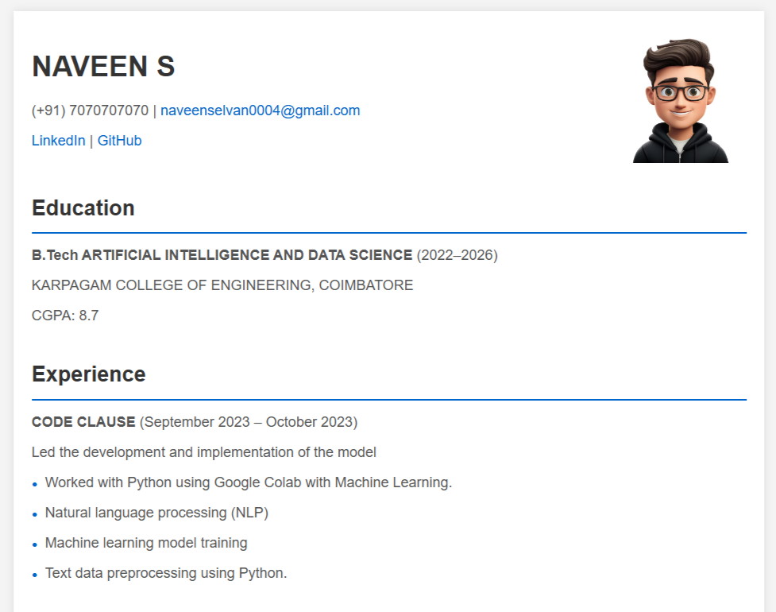

# 🌐 Responsive Resume Website

A sleek, minimalist resume website built with **HTML** and **CSS**, designed to showcase your professional profile with clarity and style. This project offers a structured, mobile-friendly format to highlight your skills, experience, and projects.

---

## 📸 Preview


---

## 🚀 Features
- **Responsive Layout**: Adapts seamlessly across all devices, from desktops to mobile screens.
- **Professional Design**: Clean, organized sections for a polished, easy-to-read presentation.
- **Simple Customization**: Modify the HTML and CSS to add your personal touch effortlessly.
- **Modern UI**: Subtle colors and typography choices maintain a refined, professional look.

---

## 📂 Sections Included
- **Header**: Name, contact information, LinkedIn, and GitHub links.
- **Education**: Educational background and GPA.
- **Experience**: Relevant work experience and roles.
- **Certifications**: Certifications, including issuing organizations.
- **Projects**: Highlighted projects with technology stack.
- **Skills**: Technical and soft skills.
- **Achievements**: Key personal and professional accomplishments.

---

## 🛠️ Usage
1. **Clone the Repository**:
   ```bash
   git clone https://github.com/your-username/resume-website.git
   ```
2. **Customize Your Information**:
   - Open `index.html` and replace placeholder text with your own details.
   - Adjust styles in `style.css` to personalize the look and feel.
3. **Preview Your Resume**:
   - Open `index.html` in your browser to view the changes.
4. **Deploy**:
   - Easily deploy to GitHub Pages or any static hosting platform to make it accessible online.

---

## 🌍 Deployment on GitHub Pages
1. Go to your GitHub repository.
2. Click on **Settings** > **Pages**.
3. Choose the `main` branch and `/root` directory.
4. Save, and your resume website will be live at `https://your-username.github.io/resume-website`.

---

## 📜 License
This project is open-source under the [MIT License](LICENSE). Feel free to use, modify, and distribute it as per the license terms.

---

## 👏 Contributing
Contributions are welcome! If you have ideas to improve this project, please fork the repository, create a new branch, and submit a pull request.

---

Crafted with 💻 and ☕ by [Your Name](https://www.linkedin.com/in/your-profile)
